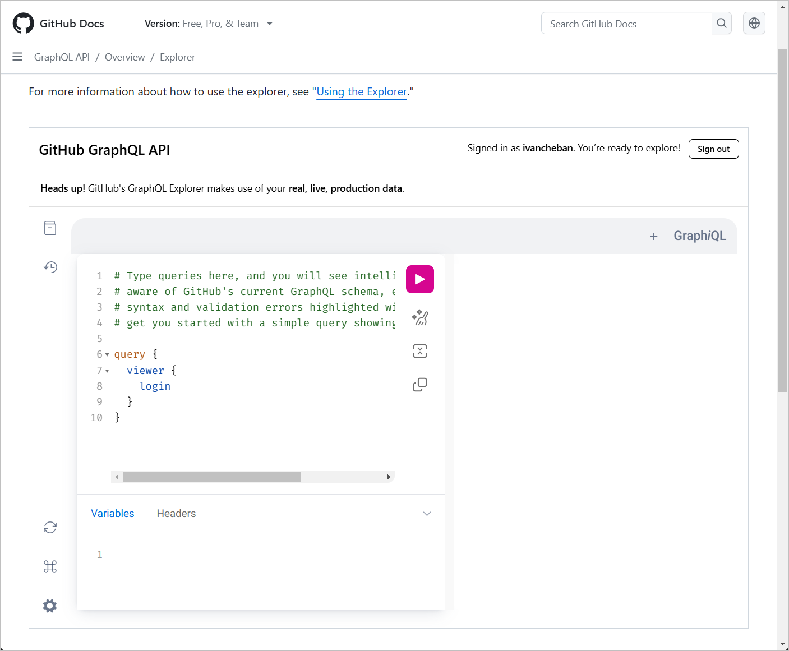
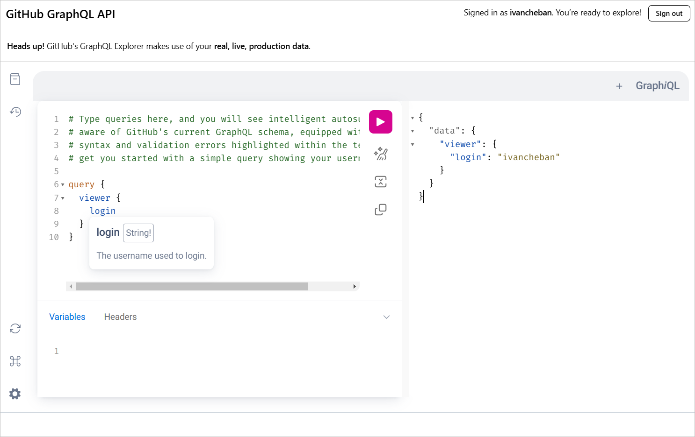
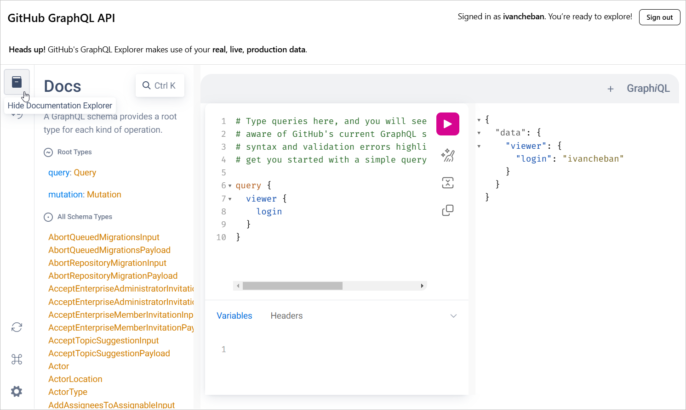
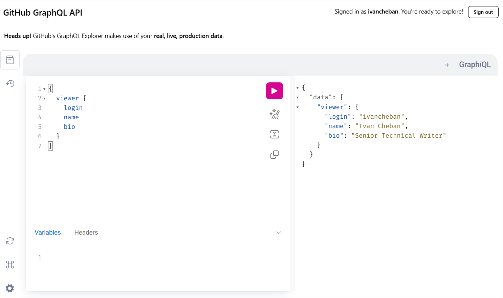
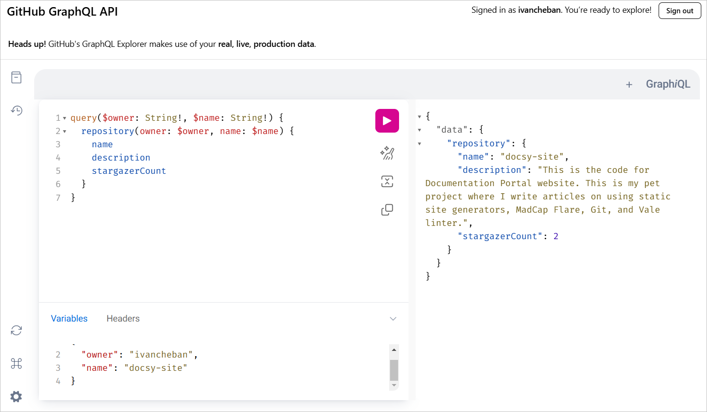

# Task 1

<div style={{
  marginBottom: '1rem',
  padding: '1rem',
  backgroundColor: '#f0f8ff',
  borderLeft: '4px solid #4682b4',
  borderRadius: '4px',
}}>
  <p style={{
    margin: 0,
    color: '#333',
    fontSize: '1rem',
    lineHeight: 1.5,
  }}>
    Create a clear, step-by-step procedure that introduces the reader to a technology you interact with regularly. This could be a tool, software, or system you use in your work or personal life. Assume the reader is an average internet and mobile user with basic familiarity but no advanced expertise in technology, and ensure your procedure is accessible and easy to follow.<br></br><br></br>Specify the time used to complete the task.
  </p>
</div>

## Beginner's guide to GraphQL queries in GitHub's GraphiQL Editor

GraphQL is a query language for APIs, and GitHub provides a GraphiQL interface to explore and test GraphQL queries. This guide will help you get started with making simple queries for your repository.

### Step 1: Access GitHub's GraphiQL Editor

1. Go to [GitHub's GraphQL Explorer](https://docs.github.com/en/graphql/overview/explorer).
2. If you're not already logged in to GitHub, you'll be prompted to do so.
3. Once logged in, you'll see the GraphiQL interface: a panel for writing queries on the left, and a panel for viewing results on the right.

    

### Step 2: Understand the basic query structure

A basic GraphQL query looks like this:

```graphql
query {
  viewer {
    login
  }
}
```

This query asks for the login name of the current user (viewer).

### Step 3: Run your first query

1. In the left panel of the GraphiQL editor, type the query from Step 2.
1. Click the "Play" button (a triangle icon) at the top of the editor. Alternatively, you can press <kbd>Ctrl</kbd>+<kbd>Enter</kbd>.
1. In the right panel, you'll see the result, which should include your GitHub username.

    

### Step 4: Explore available fields

1. In the GraphiQL interface, look for the "Docs" tab on the right side.
1. Click on it to open the documentation explorer.
1. Here, you can browse all available queries and fields.

    

1. Try adding more fields to your query, like this:

    ```graphql
    query {
      viewer {
        login
        name
        bio
      }
    }
    ```

    

### Step 5: Query specific data

Let's try a query to fetch information about a specific repository:

```graphql
query {
  repository(owner: "ivancheban", name: "docsy-site") {
    name
    description
    stargazerCount
  }
}
```

This query fetches the name, description, and number of stars for the "docsy-site" repository owned by "ivancheban".

### Step 6: Use query variables

At the bottom of the GraphiQL editor, you'll see a "Query Variables" section.

You can use this to make your queries more flexible. Let's modify our previous query:

```graphql
query($owner: String!, $name: String!) {
  repository(owner: $owner, name: $name) {
    name
    description
    stargazerCount
  }
}
```

In the Query Variables section, add:

```json
{
  "owner": "ivancheban",
  "name": "docsy-site"
}
```



Now you can easily change the owner and repository name without modifying the main query.

Congratulations! 🎉 You've now learned the basics of making GraphQL queries using GitHub's GraphiQL editor. Remember, GraphQL is very powerful and flexible - these examples just scratch the surface. As you become more comfortable, try exploring more complex queries and different types of data available through the GitHub API.

<div style={{
  display: 'flex',
  flexDirection: 'column',
  alignItems: 'center',
  justifyContent: 'center',
  marginTop: '20px',
  marginBottom: '20px'
}}>
  <div style={{
    fontSize: '64px',
    marginBottom: '10px'
  }}>
    ⌛
  </div>
  <div style={{
    fontSize: '24px',
    fontWeight: 'bold',
    color: '#333'
  }}>
    2:30
  </div>
  <p style={{
    textAlign: 'center',
    fontSize: '18px',
    color: '#666',
    marginTop: '10px'
  }}>
    Time spent on this task: 2 hours and 30 minutes
  </p>
</div>