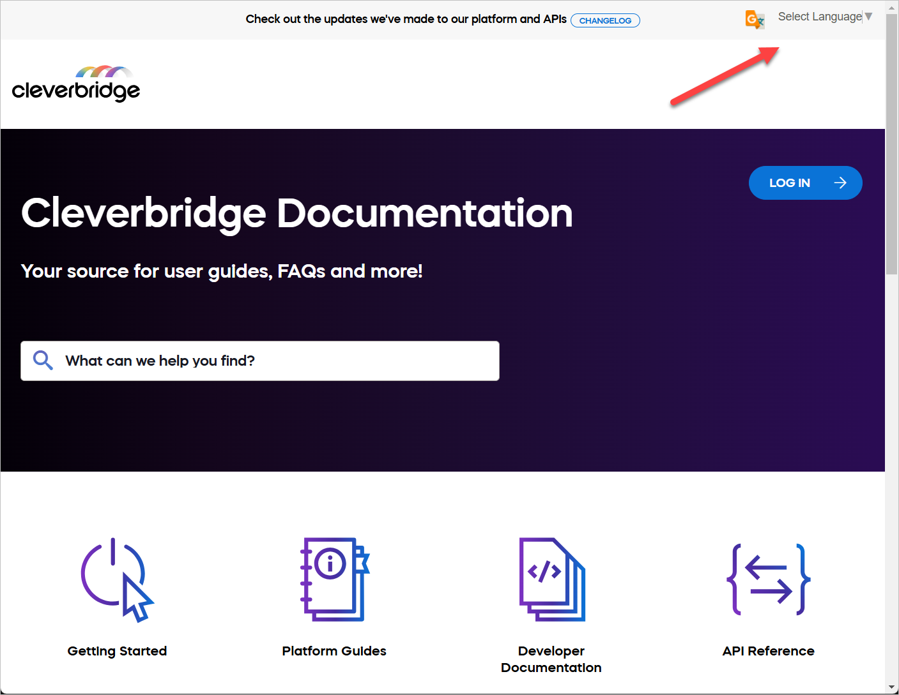
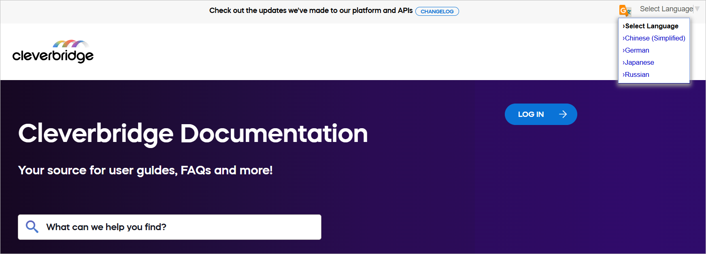
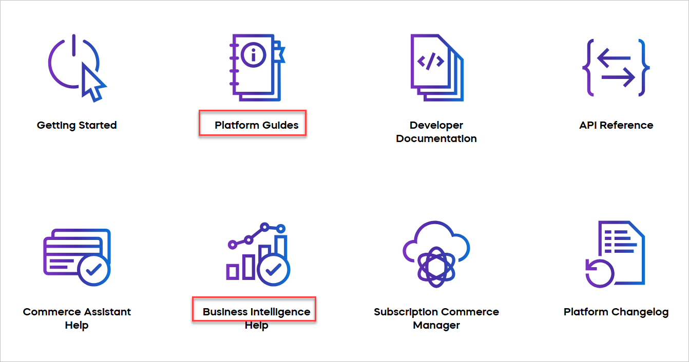
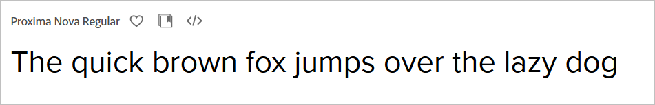

# Task 2

<div style={{
  marginBottom: '1rem',
  padding: '1rem',
  backgroundColor: '#f0f8ff',
  borderLeft: '4px solid #4682b4',
  borderRadius: '4px',
}}>
  <p style={{
    margin: 0,
    color: '#333',
    fontSize: '1rem',
    lineHeight: 1.5,
  }}>
    We are currently transitioning our <a href="https://docs.cleverbridge.com/public/all/home.htm" target="_blank" rel="noopener noreferrer" style={{ color: '#4682b4', textDecoration: 'underline' }}>business user documentation</a> to Docusaurus. Your second task is to review the Information Architecture (IA) of the current website and provide feedback on aspects that are working well and areas with room for improvement as we make this transition.
<br></br><br></br>
  Specify the time used to complete the task.
  </p>
</div>

## Removing the non-working Google Translate banner

The business user documentation site is built using MadCap Flare. Each page of this site shows the banner at the top of the page. The banner includes two elements: changelog and Google Translate language selection dropdown.



When you select any of the available languages from the dropdown menu, nothing happens. The site content isn't translated. This may confuse business users who expect the translated content.



The root of this issue is in this code of the MadCap Flare Master Page (.flmsp) markup:

```html
<div id="google_translate_element">
  <div class="skiptranslate goog-te-gadget" dir="ltr" style="">
    <div
      id=":0.targetLanguage"
      class="goog-te-gadget-simple"
      style="white-space: nowrap;"
    >
      <span style="vertical-align: middle;"
        ><a aria-haspopup="true" class="VIpgJd-ZVi9od-xl07Ob-lTBxed" href="#"
          ><span>Select Language</span
          ><span style="border-left: 1px solid rgb(187, 187, 187);"
            >&ZeroWidthSpace;</span
          ><span aria-hidden="true" style="color: rgb(118, 118, 118);"
            >▼</span
          ></a
        ></span
      >
    </div>
  </div>
</div>
```

**My recommendation:** Either remove this code from the Master Page in MadCap Flare, or fix the issue with Google Translate API that prevents the content translation.

## Changing the site font

The business user documentation site uses the Mazzard H font. While looking funny and grotesque, this font doesn't suit the purpose of the site. It makes users guess and strain their eyes. For example, the issue with dots above the "i" letter. It's difficult to tell the difference between "i" and "l" letters.



**My recommendation:** Change to some more readable font, for example, [Proxima Nova](https://fonts.adobe.com/fonts/proxima-nova).



## Improving the site information architecture

import Tabs from '@theme/Tabs';
import TabItem from '@theme/TabItem';

<Tabs>
  <TabItem value="positive" label="Positive Aspects" default>
    <ol>
      <li>
        <strong>Clear categories</strong>: The main categories are clear and cover different areas of the platform. This makes it easier for users to find information. Each category (for example, Getting Started, Platform Guides, Developer Documentation) covers a specific part of the documentation.
      </li>
      <li>
        <strong>Visual aids</strong>: Icons for each category help users quickly identify different sections. These visual clues make it easier for users to recognize content types.
      </li>
      <li>
        <strong>Wide coverage</strong>: The navigation includes both user guides (for example, Platform Guides, Commerce Assistant Help) and technical documentation (for example, Developer Documentation, API Reference). This helps different types of users, from business users to developers, find the information they need.
      </li>
      <li>
        <strong>Tool-specific sections</strong>: Dedicated sections for Commerce Assistant, Business Intelligence, and Subscription Commerce Manager help users find tool-specific information quickly.
      </li>
      <li>
        <strong>User-centric organization</strong>: The structure seems to follow a user's journey, starting with "Getting Started" and moving to more specific guides and tools.
      </li>
      <li>
        <strong>Logical grouping</strong>: Related items are put together, like Commerce Assistant Help and Business Intelligence Help. This helps users find related information easily and understand how different parts of the platform connect.
      </li>
      <li>
        <strong>Quick start option</strong>: The "Getting Started" section is easy to find, which helps new users. This allows new users to quickly find basic information without being overwhelmed by advanced topics.
      </li>
    </ol>
  </TabItem>
  <TabItem value="improvement" label="Areas for Improvement">
    <ol>
      <li>
        <strong>Better organization</strong>: Think about reorganizing the categories to make them clearer. For example, put user guides and developer documentation in separate groups. This can help users find what they need more easily based on their role.
      </li>
      <li>
        <strong>Consistent naming</strong>: Make sure names are consistent. For example, "Platform Guides" and "Commerce Assistant Help" could have more similar names. This helps users predict where to find certain types of information.
      </li>
      <li>
        <strong>Incomplete sections</strong>: Items marked with ✱ suggest incomplete or special sections. Ensure all sections look the same as it looks awkward in the navigation.
      </li>
      <li>
        <strong>Unclear prioritization</strong>: It's not immediately clear which items are most important or frequently used. Consider highlighting key or popular topics.
      </li>
      <li>
        <strong>Potential overlap</strong>: There might be overlap between sections like "Platform Guides" and specific tool helps. Ensure clear distinctions or cross-referencing between these areas.
      </li>
      <li>
        <strong>Naming consistency</strong>: Some section names are action-oriented (for example, "Manage Users") while others are noun-based (for example, "User Interface"). Aim for more consistent naming across sections.
      </li>
      <li>
        <strong>Room for growth</strong>: As you move to Docusaurus, think about how the current structure will handle new content. Make sure the new structure can easily add new sections without messing up the overall organization.
      </li>
      <li>
        <strong>More internal links</strong>: In the new Docusaurus setup, add more links between related topics in different categories. This helps users find relevant information and understand how different parts of the platform are connected.
      </li>
      <li>
        <strong>Feedback option</strong>: In the new Docusaurus setup, add a way for users to give feedback on the documentation in each section. This can help you keep improving the documentation based on what users need.
      </li>
      <li>
        <strong>Tags</strong>: Implement tags and categories to improve content organization and discoverability.
      </li>
    </ol>
  </TabItem>
</Tabs>

<div style={{
  display: 'flex',
  flexDirection: 'column',
  alignItems: 'center',
  justifyContent: 'center',
  marginTop: '20px',
  marginBottom: '20px'
}}>
  <div style={{
    fontSize: '64px',
    marginBottom: '10px'
  }}>
    ⌛
  </div>
  <div style={{
    fontSize: '24px',
    fontWeight: 'bold',
    color: '#333'
  }}>
    3:30
  </div>
  <p style={{
    textAlign: 'center',
    fontSize: '18px',
    color: '#666',
    marginTop: '10px'
  }}>
    Time spent on this task: 3 hours and 30 minutes
  </p>
</div>
